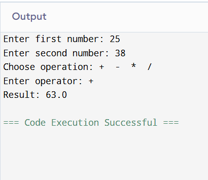

# Java Calculator

A simple console-based calculator application developed in Java.  
The program performs basic arithmetic operations based on user input.

---

## Features
- Addition
- Subtraction
- Multiplication
- Division
- Handles division by zero

---

## Technologies Used
- Java
- Scanner class for user input

---

## How to Run

Run your program in online compiler
Take a screenshot of the output
Save it as:
output.png
---

## Sample Output

---

## Example Execution

Enter first number: 10  
Enter second number: 5  
Choose operation: +  -  *  /  
Enter operator: *  
Result: 50.0  

---

## Project Structure

Calculator.java  
output.png  
README.md  

---

## Author
JERMILA J V
